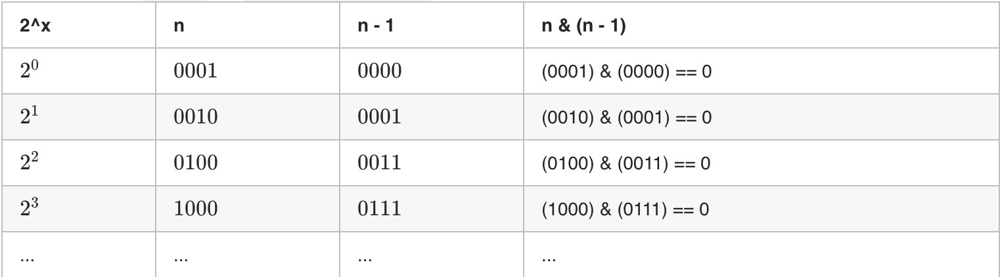

# 二进制技巧

#### 2的幂充要条件

* 若 $n = 2^x$ 且 $x$ 为自然数（即 n 为 2 的幂），则一定满足以下条件：
    1. 恒有 `n & (n - 1) == 0`，这是因为：
        * n 二进制最高位为 1，其余所有位为 0；
        * n - 1 二进制最高位为 0，其余所有位为 1；
    2. 一定满足 `n > 0`。

* 因此，通过 `n > 0` 且 `n & (n - 1) == 0` 即可判定是否满足 $n = 2^x$ 。

#### 按位与技巧(&)

* 如何获取二进制中最右边的 1：x & (-x)。
* 如何将二进制中最右边的 1 设置为 0：x & (x - 1)。